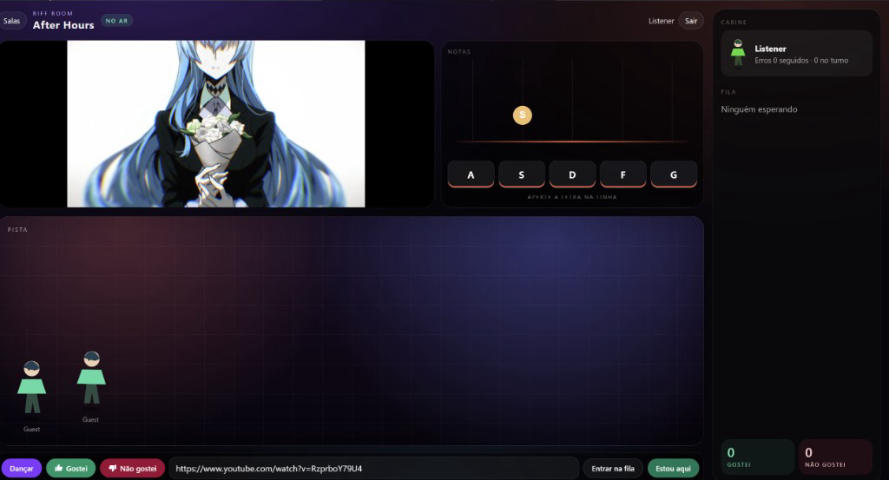

# Riff Room

> Sala ao vivo em **Ruby on Rails + Hotwire**.
> O clipe oficial do YouTube fica na tela. Letras `A S D F G` caem para o DJ.
> Uma pessoa fica em uma sala só. Voto e dança só valem com música no ar.
> Spec-Driven. O spec vivo está em [`openspec/specs/room/spec.md`](openspec/specs/room/spec.md).



| | |
|--|--|
| Linguagem | Ruby 3.4.8, Rails 8 |
| UI | Hotwire, Stimulus, TypeScript, Tailwind |
| Vídeo | [YouTube IFrame API](https://developers.google.com/youtube/iframe_api_reference) |
| Persistência | SQLite, um escritor (Puma) |
| Fora de escopo | chat, extrair áudio, voto que pula o DJ |

## SDD (comece por aqui)

| Arquivo | Papel |
|---------|--------|
| [`docs/prd.md`](docs/prd.md) | **O quê** |
| [`openspec/specs/room/spec.md`](openspec/specs/room/spec.md) | Spec viva da sala |
| [`docs/trd.md`](docs/trd.md) | **Como** |
| [`docs/engineering.md`](docs/engineering.md) | Limites e padrões |
| [`AGENTS.md`](AGENTS.md) | Briefing do agente |
| [`docs/c4/`](docs/c4/) | Contexto, containers, componentes |
| [`docs/rfc/`](docs/rfc/) | Porquês |
| [`docs/runbook.md`](docs/runbook.md) | Como operar |
| [`docs/images/sala.jpg`](docs/images/sala.jpg) | Print da sala |
| [`LICENSE`](LICENSE) | MIT (código) |

Se código e spec divergirem, a **spec manda**.

## Pré-requisitos

- Ruby 3.4.8 (`.ruby-version`)
- Bundler
- Node.js (o boot de desenvolvimento compila o TypeScript)

```bash
# Debian/Ubuntu / WSL, com asdf ou o Ruby já no PATH
ruby -v   # 3.4.8
```

## Como rodar

```bash
cd riff_room_system_ui
bundle install
bin/rails db:prepare
bin/rails server
bin/verify
```

O lobby fica em `http://localhost:3000`. Conta nova em `/registration/new`. Salas: `/rooms/neon-floor`, `after-hours`, `rooftop`, `basement`.

Ouvir não pede conta. Com conta, a pessoa cola a URL, entra na fila, vira DJ e vota. **Estou aqui** coloca o avatar na pista. Abrir outra sala sai da anterior.

`bin/dev` sobe o servidor e o watch do Tailwind. Redis só entra se `ANYCABLE=1`. Sem isso, o desenvolvimento usa o adapter async do Action Cable.

| Ação | Efeito |
|------|--------|
| `A` `S` `D` `F` `G` | Acertar a nota. Só a tecla do DJ conta |
| Nota que passa, ou letra errada | A tela mostra **Errou** |
| 3 erros seguidos, ou 8 no turno | A vez passa para o próximo da fila |
| Fim do vídeo, ou erro do player | A vez também passa |
| Gostei / Não gostei | Um voto por perfil por música. Não pula o DJ |
| Dançar | O avatar dança enquanto a música toca |
| Estou aqui | Entra na pista desta sala e sai da outra |

## Arquitetura

```
riff_room_system_ui/
  AGENTS.md
  LICENSE
  openspec/specs/room/spec.md
  docs/prd.md trd.md engineering.md runbook.md
  docs/c4/ docs/rfc/ docs/images/sala.jpg
  packages/booth presence performance appreciation room shared_kernel
  app/views app/javascript
  spec/
```

`packages/*/lib/domain` e `application` não importam Rails. ActiveRecord fica na infraestrutura de cada pacote. O controller chama `RoomGateway`. A UI fica em `app/`.

O relógio da sala segue o `started_at` do turno. Sair da aba não pausa a música para os outros. Ao voltar, o player busca o ponto em que o clipe já está.

## Licença

MIT para o **código** do Riff Room. Ver [`LICENSE`](LICENSE).

Os clipes pertencem a quem publicou no YouTube. O Riff Room só embute o player oficial. Não extrai nem redistribui o áudio.
