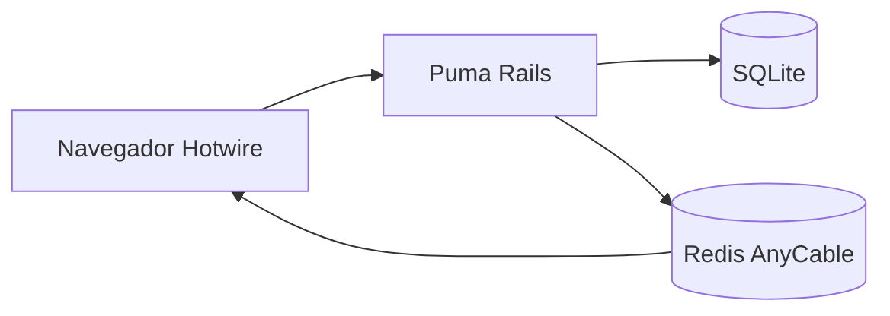

# C4 — Contêineres

```mermaid
flowchart LR
  browser[Navegador Hotwire]
  puma[Puma Rails]
  sqlite[(SQLite)]
  redis[(Redis AnyCable)]
  browser --> puma
  puma --> sqlite
  puma --> redis
  redis --> browser
```
